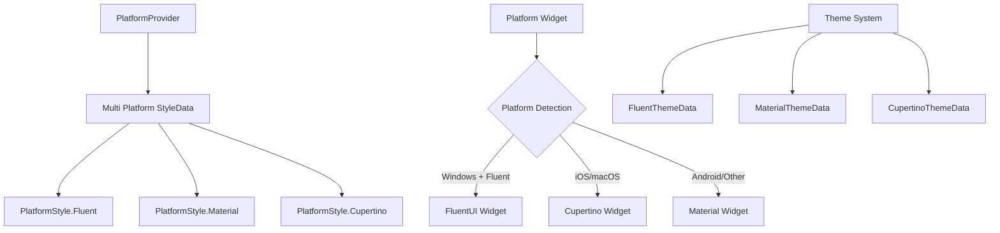

# Design Document

## Overview

This design extends the existing flutter_platform_widgets architecture to support fluent_ui widgets on Windows platform. The solution uses dependency inversion to create a pluggable system where fluent_ui widgets can be seamlessly integrated alongside existing Material and Cupertino implementations.

The approach maintains backward compatibility while providing a clean extension mechanism that follows the existing patterns in flutter_platform_widgets.

## Architecture

### Current Architecture Analysis

The current flutter_platform_widgets uses:
- `PlatformStyle` enum with `Material` and `Cupertino` options
- `PlatformStyleData` class that maps platforms to styles
- Individual platform widget implementations that switch based on style

### Proposed Multi Platform Architecture



## Components and Interfaces

### 1. Extended Platform Style System

**PlatformStyle Extension**
```dart
enum PlatformStyle {
  Material,
  Cupertino,
  Fluent,  // New addition
}
```

**Multi Platform StyleData**
```dart
class PlatformStyleData {
  final PlatformStyle android;
  final PlatformStyle ios;
  final PlatformStyle macos;
  final PlatformStyle windows;  // Can now be set to Fluent
  final PlatformStyle web;
  final PlatformStyle fuchsia;
  final PlatformStyle linux;
  
  const PlatformStyleData({
    this.android = PlatformStyle.Material,
    this.ios = PlatformStyle.Cupertino,
    this.macos = PlatformStyle.Cupertino,
    this.windows = PlatformStyle.Fluent,  // Default to Fluent on Windows
    this.web = PlatformStyle.Material,
    this.fuchsia = PlatformStyle.Material,
    this.linux = PlatformStyle.Material,
  });
}
```

### 2. Multi Platform Widget Support

**Abstract Platform Widget Interface**
```dart
abstract class PlatformWidgetBuilder<T extends Widget> {
  T buildMaterial(BuildContext context);
  T buildCupertino(BuildContext context);
  T buildFluent(BuildContext context);  // New method
}
```

**Multi Platform Widget Base**
```dart
class MultiPlatformWidget<T extends Widget> extends PlatformWidget {
  final PlatformWidgetBuilder<T> builder;
  
  @override
  Widget build(BuildContext context) {
    final style = PlatformProvider.of(context)?.platformStyle;
    
    switch (style) {
      case PlatformStyle.Fluent:
        return builder.buildFluent(context);
      case PlatformStyle.Cupertino:
        return builder.buildCupertino(context);
      case PlatformStyle.Material:
      default:
        return builder.buildMaterial(context);
    }
  }
}
```

### 3. Theme Integration System

**Fluent Theme Adapter**
```dart
class FluentThemeAdapter {
  static FluentThemeData fromMaterialTheme(ThemeData materialTheme) {
    return FluentThemeData(
      accentColor: materialTheme.colorScheme.primary.toAccentColor(),
      brightness: materialTheme.brightness,
      // Map other theme properties
    );
  }
  
  static FluentThemeData fromSystemTheme() {
    // Integration with system_theme package for Windows accent colors
    return FluentThemeData(
      accentColor: SystemTheme.accentColor.accent.toAccentColor(),
    );
  }
}
```

### 4. Core Platform Widgets Implementation

**PlatformApp Multi Platform Support**
```dart
class FluentPlatformApp extends PlatformApp {
  @override
  Widget build(BuildContext context) {
    final style = PlatformProvider.of(context)?.platformStyle;
    
    if (style == PlatformStyle.Fluent) {
      return FluentApp(
        theme: FluentThemeAdapter.fromMaterialTheme(materialLightTheme),
        darkTheme: FluentThemeAdapter.fromMaterialTheme(materialDarkTheme),
        // Map other properties
      );
    }
    
    return super.build(context);  // Fallback to existing implementation
  }
}
```

## Data Models

### Configuration Models

**FluentConfiguration**
```dart
class FluentConfiguration {
  final bool useSystemAccentColor;
  final bool enableAcrylicEffects;
  final FluentNavigationStyle navigationStyle;
  
  const FluentConfiguration({
    this.useSystemAccentColor = true,
    this.enableAcrylicEffects = true,
    this.navigationStyle = FluentNavigationStyle.automatic,
  });
}
```

**Multi Platform SettingsData**
```dart
class PlatformSettingsData {
  // Existing properties...
  final FluentConfiguration? fluentConfiguration;
  
  const PlatformSettingsData({
    // Existing parameters...
    this.fluentConfiguration,
  });
}
```

### Widget Mapping Models

**PlatformWidgetMapping**
```dart
class PlatformWidgetMapping {
  static const Map<Type, Type> fluentWidgetMap = {
    PlatformScaffold: FluentScaffold,
    PlatformAppBar: FluentNavigationView,
    PlatformButton: FluentButton,
    PlatformTextField: FluentTextBox,
    // Additional mappings
  };
}
```

## Error Handling

### Dependency Management
- **Missing fluent_ui dependency**: Graceful fallback to Material widgets with console warning
- **Version compatibility**: Runtime checks for fluent_ui version compatibility
- **Platform detection errors**: Default to Material style on detection failure

### Widget Fallbacks
```dart
Widget buildFluentWithFallback(BuildContext context, Widget Function() fluentBuilder, Widget Function() materialBuilder) {
  try {
    if (isFluentUIAvailable()) {
      return fluentBuilder();
    }
  } catch (e) {
    debugPrint('Fluent UI fallback: $e');
  }
  return materialBuilder();
}
```

### Theme Mapping Errors
- **Color conversion failures**: Use default fluent_ui colors
- **Missing theme properties**: Apply sensible defaults
- **System theme access errors**: Fallback to app-defined themes

## Testing Strategy

### Unit Tests
1. **Platform Style Detection Tests**
   - Test correct style selection based on platform
   - Test fallback behavior for unsupported platforms
   - Test configuration override scenarios

2. **Theme Mapping Tests**
   - Test Material to Fluent theme conversion
   - Test system theme integration
   - Test light/dark mode switching

3. **Widget Builder Tests**
   - Test widget creation for each platform style
   - Test fallback mechanisms
   - Test API compatibility

### Integration Tests
1. **Cross-Platform Consistency Tests**
   - Test same functionality across all platforms
   - Test navigation patterns preservation
   - Test state management consistency

2. **Theme Integration Tests**
   - Test theme switching at runtime
   - Test system theme synchronization
   - Test custom theme application

### Widget Tests
1. **Platform Widget Tests**
   - Test each multi platform widget
   - Test widget property mapping
   - Test event handling consistency

2. **Visual Regression Tests**
   - Test fluent_ui widget appearance
   - Test theme application correctness
   - Test responsive behavior

### Performance Tests
1. **Widget Creation Performance**
   - Benchmark widget instantiation overhead
   - Test memory usage patterns
   - Test rebuild efficiency

2. **Theme Switching Performance**
   - Test theme change responsiveness
   - Test system theme sync performance
   - Test large widget tree updates